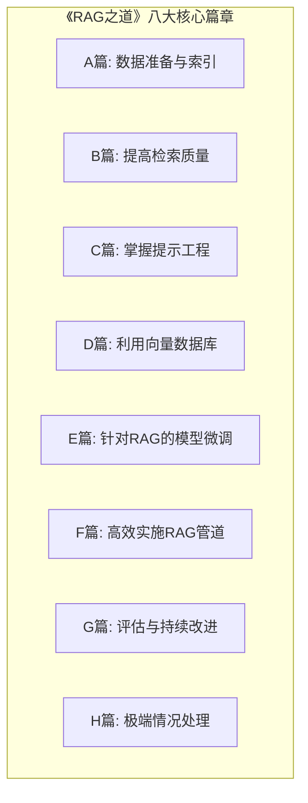

# 引言：为何RAG是通往更智能AI的必经之路

在人工智能的浪潮中，大型语言模型（Large Language Models, LLMs）以其惊人的文本生成和理解能力，彻底改变了我们与信息的交互方式。然而，即便是最强大的LLM，也面临着两大与生俱来的核心挑战：

1. **知识的“保质期”问题：** LLM的知识被冻结在其训练数据的截止日期，无法获取在那之后的最新信息，也无法访问私有的、实时的知识库。
2. **“幻觉” (Hallucination) 问题：** 当遇到其知识范围之外或模糊的问题时，它们有时会自信地编造听起来合理但不真实、无据可查的答案。

为了克服这些局限，**检索增强生成（Retrieval-Augmented Generation, RAG）**技术应运而生。RAG是一种将外部知识库的实时信息检索与LLM强大的生成能力相结合的策略。[[**1**]][[**2**]] 简单来说，当用户提出问题时，RAG系统首先会从一个庞大的、可实时更新的知识库（如公司内部文档、网站、数据库等）中检索出最相关的信息片段，然后将这些信息连同原始问题一起作为上下文（Context）提供给LLM，指导其生成一个有据可依、内容准确、与时俱进的回答。[[**2**]]

RAG的出现，不仅有效地缓解了LLM的幻觉问题，还赋予了其访问私有、特定领域知识的能力，极大地扩展了LLM的应用场景。[[**2**]] 它就像为一位博学的学者配备了一个能够随时联网查询最新文献的超级图书馆。本文将遵循一条从基础构建到高级优化的清晰路径，全面深入地探讨《RAG之道》，旨在为开发者和研究者提供一份从理论到实践的详尽指南。我们将逐一剖析数据准备、检索质量、提示工程、向量数据库、模型微调、管道效率、评估体系及风险应对等各个关键环节，助您构建出高效、可靠且智能的RAG系统。

