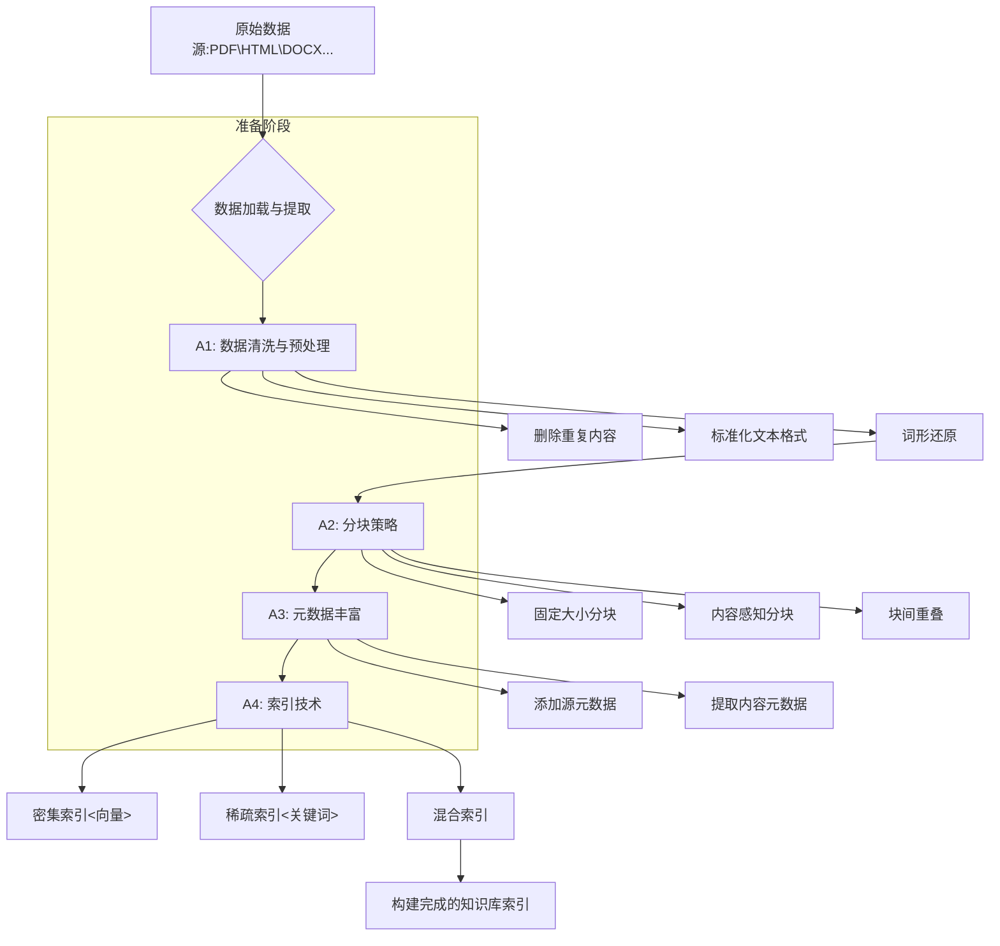

# 开篇: 优化数据准备与索引

> **数据的“精耕细作”是RAG成功的基石**
> 

在构建任何一个RAG系统时，我们最先面对的不是炫酷的语言模型，也不是复杂的检索算法，而是原始、杂乱、形态各异的数据。您可以将自己想象成一位米其林三星大厨，而数据就是您的食材。再高超的厨艺，也无法将腐烂、劣质的食材变成珍馐佳肴。同理，RAG系统的数据准备与索引阶段，就是对“食材”进行精挑细选、清洗处理、精细切割的过程。

这个阶段的工作，往往占据了整个RAG项目70%以上的精力，但它也决定了系统性能的上限。一个经过“精耕细作”的知识库，能够让后续的检索和生成过程事半功倍；反之，一个充满噪音、结构混乱的知识库，则会成为整个系统性能的瓶颈，即使最先进的LLM也无力回天。

本章将作为您的“备料指南”，深入探讨数据准备与索引的四大核心支柱：**数据清洗与预处理**、**分块策略**、**元数据丰富**和**索引技术**。我们将从基本概念出发，辅以可直接运行的代码示例、生动的类比、巧妙的设计和常见问题剖析，助您为您的RAG系统打下最坚实的基础。

- **A1: 数据清洗与预处理——为知识库“提纯”**
    - 删除重复内容 (Deduplication)
    - 标准化文本格式 (Text Normalization)
    - 词干提取与词形还原 (Stemming & Lemmatization)
- **A2: 分块策略 (Chunking)——在上下文与精度间寻求平衡**
    - 固定大小分块 (Fixed-Size Chunking)
    - 内容感知分块 (Content-Aware Chunking)
    - 块间重叠 (Chunk Overlap)
- **A3: 元数据丰富 (Metadata Enrichment)——赋予数据可过滤的“维度”**
    - 源元数据 (Source Metadata)
    - 内容元数据 (Content-based Metadata)
- **A4: 索引技术 (Indexing)——构建通往知识的高速公路**
    - 索引方法的核心分类
    - 混合检索 (Hybrid Search)

[**A1：数据清洗与预处理——为知识库“提纯”**](https://www.notion.so/A1-25f55a58d45c8017ad72c49a99e55862?pvs=21)

[**A2：分块策略 (Chunking)——在上下文与精度间寻求平衡**](https://www.notion.so/A2-Chunking-25f55a58d45c8016a2dff1fd3d33b881?pvs=21)

[**A3：元数据丰富 (Metadata Enrichment)——赋予数据可过滤的“维度”**](https://www.notion.so/A3-Metadata-Enrichment-25f55a58d45c8097b4ddcaa47ed715ef?pvs=21)

[**A4：索引技术 (Indexing)——构建通往知识的高速公路**](https://www.notion.so/A4-Indexing-25f55a58d45c80bda53fe16e0b2a23d9?pvs=21)

### **引用文献 (References)**

- Lewis, P., Perez, E., Piktus, A., Petroni, F., Karpukhin, V., Goyal, N., ... & Kiela, D. (2020). Retrieval-Augmented Generation for Knowledge-Intensive NLP Tasks. *Advances in Neural Information Processing Systems, 33*, 9459-9474.
- Vaswani, A., Shazeer, N., Parmar, N., Uszkoreit, J., Jones, L., Gomez, A. N., ... & Polosukhin, I. (2017). Attention is all you need. *Advances in Neural Information Processing Systems, 30*.