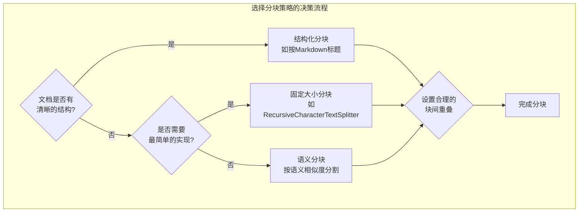

分块（Chunking）是将大型文档分解为更小、更易于管理的文本片段（Chunks）的过程。这是RAG中最关键的步骤之一，因为它直接定义了检索的最小单位。

想象一下用**放大镜**看一幅巨大的画。

- **小块 (Small Chunks):** 就像用一个**高倍放大镜**。你可以非常清晰地看到画作的每一个笔触和细节（高精度），但很容易迷失方向，不知道这个细节在整幅画中的位置（上下文丢失）。
- **大块 (Large Chunks):** 就像用一个**低倍放大镜**。你可以看到一个完整的场景，理解人物关系（上下文完整），但可能会包含很多无关的背景，无法聚焦于你真正想看的那个细节（噪音干扰）。

理想的“块”应该是一个**“原子化的语义单元”**——既足够小以保持主题的单一性，又足够大以包含理解自身所需的完整上下文。




## **固定大小分块 (Fixed-Size Chunking)**

这是最简单直接的分块方法。它不考虑文本的内在结构，而是按照预设的长度来切分。LangChain中的RecursiveCharacterTextSplitter是此方法的优秀实现，它会智能地尝试按有意义的边界（如段落\n\n、句子.）进行递归切分，比纯粹按字符数“一刀切”要好得多。

- **可执行代码示例 (使用LangChain):**

```python
# 准备环境:
# pip install langchain tiktoken

from langchain.text_splitter import RecursiveCharacterTextSplitter
import tiktoken

# 示例文本, 包含不同的结构
long_text = """
Introduction to Retrieval-Augmented Generation (RAG).

RAG is a powerful technique for enhancing Large Language Models (LLMs). It combines a retriever component, which fetches relevant information from a knowledge base, and a generator component, which is typically an LLM that produces an answer based on the retrieved context. This approach significantly reduces the risk of hallucination.

How it works:
1. User submits a query.
2. The retriever searches the knowledge base.
3. Relevant documents are passed to the LLM.
4. The LLM generates a grounded answer.
"""

# 使用tiktoken编码器来计算token数，这比简单地计算字符数更准确地反映LLM的消耗。
# 'cl100k_base'是OpenAI模型常用的编码器。
tokenizer = tiktoken.get_encoding('cl100k_base')
def tiktoken_len(text):
    return len(tokenizer.encode(text))

# 初始化分割器
text_splitter = RecursiveCharacterTextSplitter(
    # chunk_size: 每个块的最大token数。
    chunk_size=70, 
    # chunk_overlap: 两个相邻块之间重叠的token数。
    # 这有助于保持句子在块边界处的连续性。
    chunk_overlap=10,
    # length_function: 用于计算文本长度的函数。
    length_function=tiktoken_len,
    # separators: 分割器会依次尝试用这些分隔符来分割文本。
    # 它会优先尝试用 "\n\n" (段落) 分割，如果分割后的块仍然太大，
    # 就会在块内部尝试用 "\n" (行) 分割，以此类推。
    separators=["\n\n", "\n", " ", ""] 
)

chunks = text_splitter.split_text(long_text)

print(f"Original text length: {tiktoken_len(long_text)} tokens")
print(f"Split into {len(chunks)} chunks.\n")

for i, chunk in enumerate(chunks):
    print(f"--- Chunk {i+1} (Length: {tiktoken_len(chunk)} tokens) ---")
    print(chunk.replace("\n", " ")) # 替换换行符以便于显示
    print("-" * (len(chunk) + 12))
```

- **可能碰到的问题：**
    
    **上下文割裂：**即使是RecursiveCharacterTextSplitter，在块大小设置得不合理时，也可能将一个完整的句子或逻辑单元强行拆开，这是该方法固有的风险。
    

## **内容感知分块 (Content-Aware Chunking)**

内容感知分块是一种更智能的分块方法，它试图理解并利用文档的内在结构和语义来创建更具意义的块。这种策略旨在克服固定大小分块可能导致的上下文割裂问题。

### **结构化分块 (Structured Chunking):**

- **原理：** 这种方法利用文档的显式结构标记（如标题、章节、列表、表格等）来进行分块。它假设文档的结构本身就代表了内容的逻辑划分。例如，Markdown文档可以按#、##等标题级别进行分割；HTML或XML文档可以按<p>、<div>、<table>等标签进行分割。
- **优点：** 生成的块具有很强的逻辑完整性和主题单一性，非常适合处理格式规范、结构清晰的文档（如书籍、技术文档、法律条文等）。检索时，直接返回一个标题下的所有内容通常能提供高质量的上下文。
- **缺点：** 依赖于文档的良好结构。对于非结构化或格式混乱的文本，这种方法将失效。
- **适用场景：** 结构化的文档，如Markdown格式的文档库、PDF报告（通过解析结构）、API文档等。

### **语义分块 (Semantic Chunking):**

- **原理：** 这是最先进的分块策略之一。它不依赖于显式结构，而是通过计算句子或段落之间的语义相似度来决定分割点。核心思想是：当一个新句子与当前块的语义关联度低于某个预设阈值时，就认为话题发生了转变，从而在此创建一个新的块。这通常通过文本嵌入（embeddings）和聚类算法（如K-means、Mean-Shift）或滑动窗口内相似度变化检测来实现。
- **优点：** 能够处理非结构化和半结构化文本，自动识别内容的逻辑边界和主题转换点，生成的块在语义上更加连贯和聚焦。
- **缺点：** 计算成本较高，需要生成大量嵌入并进行相似度计算；阈值设置可能需要经验调整；对于非常分散或多主题的文档可能效果不佳。
- **适用场景：** 对话记录、文章摘要、评论、博客文章、聊天记录等非结构化文本，以及任何难以通过结构化方式分块的文本。


### **可执行代码示例 (使用LangChain实现结构化分块):**

```python
# 准备环境:
# pip install langchain tiktoken pypdf "unstructured[all-extra]" # unstructured用于PDF解析等高级结构化提取
# 注意: Unstructured安装可能需要一些系统依赖，特别是对于PDF和图像处理。

from langchain.text_splitter import MarkdownHeaderTextSplitter

markdown_document = """
# 产品介绍
## 核心功能
产品X拥有多项创新功能，包括实时数据分析、智能推荐系统和用户自定义界面。
这些功能旨在提升用户体验和工作效率。

### 实时数据分析
我们的数据分析模块能够处理TB级别的数据，并在毫秒级内提供洞察。

## 技术架构
产品基于微服务架构，后端采用Python和Go语言开发，前端使用React。
数据库选择PostgreSQL和MongoDB以满足不同数据需求。

# 定价策略
我们提供多种订阅方案，包括基础版、专业版和企业版。
"""

# 定义标题和块的映射
headers_to_split_on = [
    ("#", "Header1"),
    ("##", "Header2"),
    ("###", "Header3"),
]

markdown_splitter = MarkdownHeaderTextSplitter(
    headers_to_split_on=headers_to_split_on,
    strip_headers=False # 保留标题在块内
)

md_chunks = markdown_splitter.split_text(markdown_document)

print(f"Original markdown document length: {len(markdown_document)} characters")
print(f"Split into {len(md_chunks)} chunks.\n")

for i, chunk in enumerate(md_chunks):
    print(f"--- Markdown Chunk {i+1} ---")
    print(f"Metadata: {chunk.metadata}") # 包含提取的标题信息
    print(chunk.page_content)
    print("-" * 30)

# 语义分块通常涉及更复杂的步骤，如生成embeddings和聚类，
# 超出直接使用一个LangChain Splitter的范畴，更倾向于自定义实现或高级库。
# 这里仅示意性说明，无直接可运行代码。
# from sentence_transformers import SentenceTransformer, util
# import numpy as np
#
# model = SentenceTransformer('all-MiniLM-L6-v2')
# sentences = long_text.split('.') # 简单按句号分割
# embeddings = model.encode(sentences, convert_to_tensor=True)
#
# # 计算相邻句子相似度，根据相似度骤降点进行分割
# similarities = util.cos_sim(embeddings[:-1], embeddings[1:]).diag()
# split_points = np.where(similarities < threshold)[0] + 1
# # 然后根据split_points组合句子形成语义块
```

### **可能碰到的问题：**

- **结构化分块：**
    - **文档结构不规范：** 如果文档的格式不一致或存在大量错误，结构化分块将难以奏效，甚至可能产生错误的分块。
    - **过度依赖：** 过度依赖结构可能导致丢失一些未在结构中体现的上下文信息。
- **语义分块：**
    - **计算成本高昂：** 生成嵌入和计算相似度需要消耗大量计算资源和时间，对于超大型文档可能不实用。
    - **阈值敏感：** 语义相似度阈值的设定对分块结果影响很大，需要根据具体数据集进行调优，没有普适的最佳值。
    - **模型依赖：** 分块质量高度依赖于所选嵌入模型捕获语义的能力。

## **块间重叠 (Chunk Overlap)**

无论采用何种分块策略，尤其是在固定大小分块中，块的边界处都可能发生上下文割裂，导致一个完整的语义单元被无意中拆分到两个相邻的块中。重叠是一种简单而有效的缓解措施。它让一个块的结尾部分，同时成为下一个块的起始部分，从而在检索时提供一种“冗余”的上下文。

- **目的：** 主要目的是确保即使检索命中了某个块的边界部分，也能通过重叠包含前/后块的关键信息，避免上下文丢失。它就像在每个块的边缘加上一个“安全边际”。
- **如何工作：** 当一个文档被分割成N个块时，每个块Chunk_i将包含它自身的内容以及Chunk_{i-1}的末尾overlap_size部分。
- **优点：** 简单易行，能有效缓解边界上下文丢失问题，提高检索到完整语义单元的概率。
- **缺点：** 引入了数据冗余，会增加向量数据库的存储空间和索引大小。检索时可能返回包含大量重复内容的多个块，增加LLM处理的tokens数量。

### **一个巧妙的设计——“检索时上下文扩展” (Retrieval-time Context Expansion):**

这是一种更高级的重叠思想，它将重叠的实现从分块阶段推迟到检索阶段，从而优化了存储和灵活性。

1. **分块（无重叠或最小重叠）：** 将文档切分成独立的、尽可能原子化的块 [C1, C2, C3, C4, ...]。这些块在创建时可以不包含或只包含非常小的重叠。
2. **检索：** 假如用户的查询命中了块 C3。
3. **动态扩展：** 在将C3送入LLM之前，不是直接使用C3，而是根据预设的策略，动态地将它的前一个块C2和后一个块C4拼接起来，形成一个更完整的上下文 Context = C2 + C3 + C4。这个“扩展”的范围（例如，扩展多少个前/后块）可以在检索时动态调整，甚至根据查询的复杂性或相关性分数进行智能判断。
    - **优点：**
        - **索引简洁性：** 向量数据库中存储的每个块都是独立的，没有或只有很少的冗余，节省了存储空间和索引构建时间。
        - **生成阶段灵活性：** 可以根据实际需求，在检索到相关块后，灵活地决定向LLM提供多大范围的上下文（例如，如果C3非常相关，可能只扩展C2和C4；如果C3相关性一般，可能扩展C1-C5以提供更广阔的背景）。
        - **避免冗余：** 减少了LLM处理重复信息的可能性，降低了LLM的推理成本。
    - **缺点：**
        - **实现复杂性增加：** 需要额外的逻辑来管理块之间的关系，并在检索后动态地进行拼接。这可能需要对文档结构有更深的理解或维护额外的元数据（如块的顺序ID）。
        - **需要高效的块查找：** 动态扩展需要能够快速定位被检索块的相邻块。

### **可执行代码示例 (LangChain实现重叠):**

在固定大小分块的示例中已经包含了chunk_overlap参数的使用。这里不再重复展示，而是强调其在不同策略中的通用性。


### **可能碰到的问题：**

- **重叠大小的选择：** 过小的重叠可能无法有效缓解上下文割裂，过大的重叠则会引入过多冗余，增加LLM的输入长度和处理成本，甚至可能稀释核心信息。
- **重叠冗余：** 无论是固定重叠还是检索时扩展，都存在一定程度的冗余。如果LLM在处理这些重叠部分时没有被明确告知或处理得当，可能会影响其性能或导致重复信息。
- **检索时上下文扩展的额外开销：** 尽管在存储上更高效，但在检索和生成阶段，动态拼接的逻辑会带来一些额外的计算和管理开销。