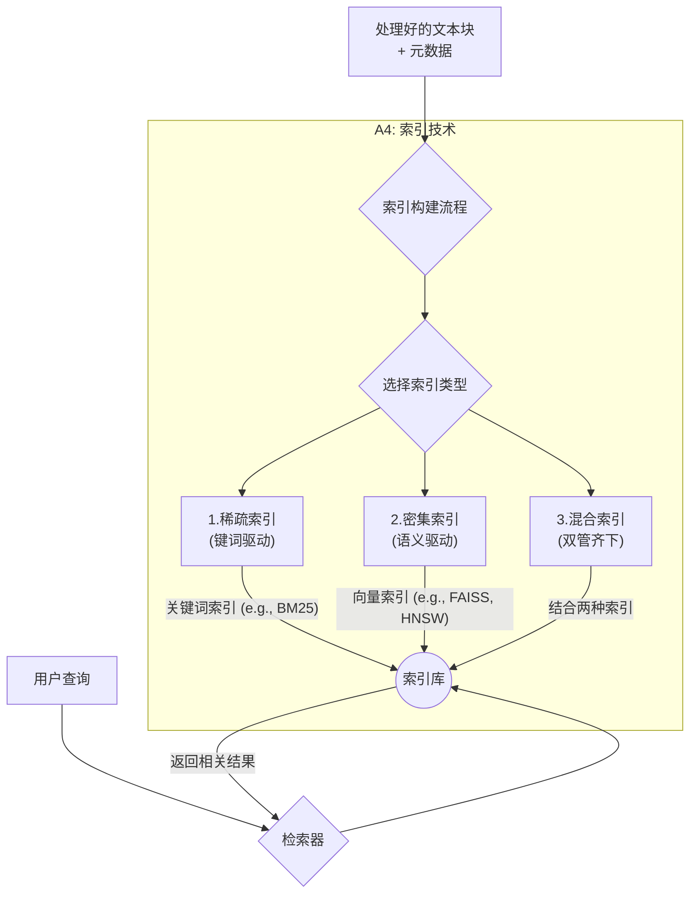
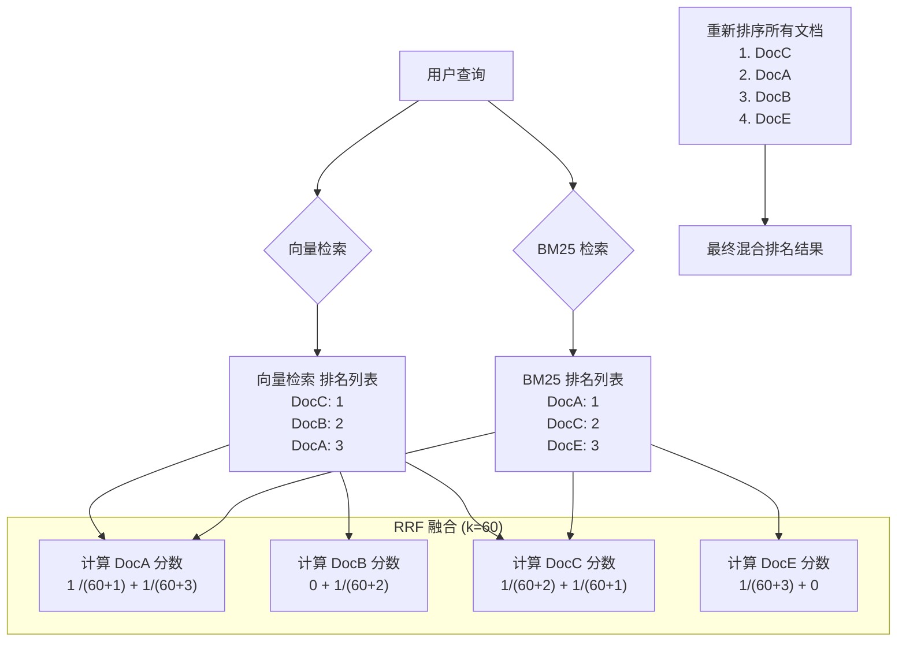
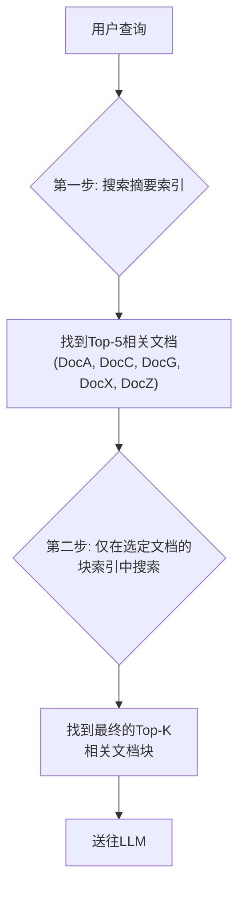

# A4：索引技术 (Indexing)——构建通往知识的高速公路

经过了清洗、分块和元数据丰富，我们的知识库现在就像一个装满了无数张高质量内容卡片的巨大仓库。但是，如果这些卡片只是随意堆放，那么每次需要查找信息时，我们仍然需要一张一张地翻找，这无异于大海捞针。索引（Indexing）技术，就是为这个无序的仓库，建立一套高效、智能的**图书管理系统**。想象一下进入一个**国家级的图书馆**。

- **没有索引：** 你会被数百万册藏书淹没，想找一本关于“量子物理”的书，可能需要花上几年时间。
- **有了索引：** 你可以走到电脑前，使用图书馆的**检索系统（索引）**。
    - 你可以通过**书名、作者（关键词）进行精确查找，系统会立刻告诉你它在哪个书架的哪一层。这就是稀疏索引**。
    - 你也可以模糊地搜索“关于时空旅行的理论”，系统不仅会推荐科幻小说，还可能推荐“广义相对论”和“弦理论”等相关物理学著作，因为它理解了你查询背后的**概念和意图**。这就是**密集索引**。

索引技术，就是将我们处理好的数据块（Chunks）组织起来，构建起一条条通往正确信息的高速公路，使得检索过程从“遍历搜索”的乡间小路，升级为“即时定位”的超级干线。



## **稀疏索引 (Sparse Indexing) - 关键词的精准定位**

稀疏索引是传统信息检索的基石。它通过一个“倒排索引”（Inverted Index）来实现，即记录每个词出现在哪些文档中。BM25 (Best Matching 25) 是目前最流行和最有效的稀疏检索算法。

- **工作原理（直观理解）：** BM25基于两个核心思想来给文档打分：
    1. **词频 (Term Frequency - TF):** 一个词在某文档中出现次数越多，该词与该文档的相关性就越高。
    2. **逆文档频率 (Inverse Document Frequency - IDF):** 一个词在**所有**文档中出现的次数越少（越罕见），它对于区分文档的重要性就越大。例如，“的”、“是”这种词几乎每篇文档都有，IDF值很低；而“夸克”这个词很罕见，IDF值就很高。

> BM25 (Best Matching 25) 是信息检索领域的一个经典排序函数，由Stephen E. Robertson等人在20世纪90年代的TREC会议项目中开发，是TF-IDF模型的重大改进。
> 
- **类比：传统的图书馆卡片目录**

稀疏索引就像一个巨大的**卡片目录柜**。每个抽屉按关键词（如“物理学”、“历史”）的字母顺序排列。你拉开“物理学”的抽屉，里面是一排卡片，每张卡片都指向一本包含“物理学”这个词的书籍。查找精确的术语非常快。

- **代码示例 (使用 rank_bm25)**

```python
# 准备环境:
# pip install rank_bm25 numpy
# 如果需要处理中文等非英语文本，建议安装jieba进行分词
# pip install jieba

import numpy as np
from rank_bm25 import BM25Okapi
# import jieba # 如果处理中文，取消此行注释

# 1. 准备我们的文档库 (Corpus)
corpus = [
    "A RAG system combines a retriever with a language model.",
    "The retriever component is crucial for finding relevant context.",
    "BM25 is a popular sparse retriever algorithm.",
    "Hybrid search combines sparse and dense retrieval methods."
]

# 2. 对文档进行分词 (Tokenization)
# 对于英文，简单的按空格分割即可。
# 对于中文，需要使用专门的分词器。
tokenized_corpus = [doc.lower().split(" ") for doc in corpus]
# def tokenize_chinese(doc):
#     return list(jieba.cut(doc))
# tokenized_corpus = [tokenize_chinese(doc) for doc in corpus]

# 3. 创建 BM25 索引对象
# BM25Okapi 是BM25算法的一个标准实现
bm25 = BM25Okapi(tokenized_corpus)
print("BM25 index created successfully.")

# 4. 定义一个查询并进行分词
query = "sparse retriever"
tokenized_query = query.lower().split(" ")
print(f"\nPerforming query: '{query}'")

# 5. 使用 get_top_n 方法获取最相关的 N 个文档
# BM25会计算查询中的每个词与语料库中所有文档的相关性分数
top_n_docs = bm25.get_top_n(tokenized_query, corpus, n=2)

print("\n--- Top 2 Relevant Documents (BM25) ---")
for i, doc in enumerate(top_n_docs):
    print(f"{i+1}: {doc}")

# 你也可以获取所有文档的分数
doc_scores = bm25.get_scores(tokenized_query)
print("\n--- All Document Scores (BM25) ---")
for i, score in enumerate(doc_scores):
    print(f"Doc {i+1}: {score:.4f}")
```

## **密集索引 (Dense Indexing) - 语义的世界:**

密集索引不关心表面的关键词，而是关心文本背后深层的**语义**。它通过深度学习模型（嵌入模型）将每个文本块转换为一个高维浮点数向量。查询时，用户的查询也被转换为一个向量，系统通过计算向量间的距离（如余弦相似度）来找到语义上最接近的内容。

由于在高维空间中进行精确搜索（暴力搜索）存在“维度诅咒”，所有现代向量数据库都使用近似最近邻（ANN）算法来构建索引，以实现毫秒级的快速搜索。

密集索引就像一位**经验丰富且有读心术的图书管理员**。你不用告诉他完整的书名，你只需要描述你想了解的**概念**（例如，“我想了解那种能让飞船比光还快的旅行方

- **代码示例 (使用 faiss-cpu)**

```python
# 准备环境:
# pip install faiss-cpu sentence-transformers numpy
# faiss-cpu 是Facebook AI的向量搜索库的CPU版本，非常高效。

import numpy as np
import faiss
from sentence_transformers import SentenceTransformer

# 1. 准备文档库 (与BM25示例相同)
corpus = [
    "A RAG system combines a retriever with a language model.",
    "The retriever component is crucial for finding relevant context.",
    "BM25 is a popular sparse retriever algorithm.",
    "Hybrid search combines sparse and dense retrieval methods.",
    "An automobile is a wheeled motor vehicle used for transportation." # 新增一个语义相关的例子
]

# 2. 加载嵌入模型并计算所有文档的嵌入向量
print("Loading embedding model and encoding corpus...")
model = SentenceTransformer('all-MiniLM-L6-v2')
doc_embeddings = model.encode(corpus)
print("Encoding complete. Shape of embeddings:", doc_embeddings.shape)

# 3. 构建FAISS索引
# 获取向量的维度
d = doc_embeddings.shape[1] 
# IndexFlatL2 是一个基础的、使用L2距离进行精确搜索的索引。
# 它没有使用ANN，但对于小型数据集，是很好的入门和基准。
# 在D篇中，我们会探讨更高级的ANN索引如IndexIVFFlat和IndexHNSWFlat。
index = faiss.IndexFlatL2(d)

# 4. 检查索引是否已经训练 (对于IndexFlatL2，无需训练)
print("\nIs FAISS index trained?", index.is_trained)

# 5. 将文档向量添加到索引中
index.add(doc_embeddings)
print(f"Number of vectors in the index: {index.ntotal}")

# 6. 定义一个查询并进行嵌入
# 注意这个查询使用了"car"，而不是语料库中的"automobile"
query_text = "What is a car?"
query_embedding = model.encode([query_text]) # 编码时需要传入列表
print(f"\nPerforming semantic query: '{query_text}'")

# 7. 使用 index.search() 方法进行搜索
k = 2 # 我们想找最相似的2个结果
distances, indices = index.search(query_embedding, k)

print("\n--- Top 2 Relevant Documents (FAISS/Dense) ---")
for i in range(k):
    doc_index = indices[0][i]
    distance = distances[0][i]
    print(f"{i+1}: Document '{corpus[doc_index]}' (Distance: {distance:.4f})")
# 期望看到关于"automobile"的文档被高分召回，因为它与"car"语义最接近。
```

## **混合检索 (Hybrid Search)——鱼与熊掌兼得**

- **详细阐述：** 既然稀疏索引和密集索引各有优劣，最强大的策略就是将它们结合起来。混合检索同时利用关键词匹配的精确性和语义搜索的泛化能力。
- **巧妙设计——倒数排序融合 (Reciprocal Rank Fusion - RRF):**
    - **问题：** BM25的得分（例如，0-40）和余弦相似度（-1到1）的范围和分布完全不同，无法直接相加。
    - **RRF的解决方案：** RRF完全忽略原始分数，只关心每个文档在各自检索结果列表中的**排名**。
    - **算法：**
        1. 分别从BM25和向量搜索得到两个排名列表。
        2. 对于知识库中的每个文档d，计算其RRF分数：RRF_Score(d) = 1 / (k + rank_bm25(d)) + 1 / (k + rank_vector(d))
        3. rank(d)是文档d在某个列表中的排名。如果文档未出现在列表中，则该项为0。k是一个小的常数（通常设为60），用于降低高排名文档的权重影响。
        4. 按最终的RRF分数重新排序所有文档。

> Reciprocal Rank Fusion 是一种数据融合方法，在Cormack, Clarke, and Buettcher于2009年TREC会议的论文 "Reciprocal Rank Fusion Outperforms Condorcet and Individual Rank Learning Methods" 中被提出并证明其有效性。
> 



- 可行性代码

```python
# 准备环境:
# 确保 rank_bm25, faiss-cpu, sentence-transformers 都已安装

# --- 我们将复用前面两个示例中创建的对象和数据 ---
# 假设 bm25, index, model, corpus 都已存在于当前环境中

def hybrid_search(query: str, bm25_index, faiss_index, embedding_model, corpus_docs, k=5):
    """
    执行混合搜索并使用RRF进行融合。

    Args:
        query (str): 用户查询。
        bm25_index: 训练好的BM25索引对象。
        faiss_index: 添加了向量的FAISS索引对象。
        embedding_model: sentence-transformer模型。
        corpus_docs (list): 原始文档列表。
        k (int): 最终返回的结果数量。

    Returns:
        list: 一个元组列表 [(score, doc), ...]，按RRF分数降序排列。
    """
    # --- 1. 稀疏检索 (BM25) ---
    tokenized_query = query.lower().split(" ")
    bm25_scores = bm25_index.get_scores(tokenized_query)
    
    # --- 2. 密集检索 (FAISS) ---
    query_embedding = embedding_model.encode([query])
    # FAISS返回距离，我们需要将其转换为相似度分数 (这里用负距离简单模拟)
    # 并且需要获取所有文档的距离，这在IndexFlatL2中是低效的
    # 更优的做法是搜索一个较大的N，然后只处理这N个结果
    # 这里为了简单，我们假设可以拿到所有分数
    # 真实场景中，你会用 faiss_index.search()
    # 为了演示，我们手动计算所有向量的相似度
    all_doc_embeddings = embedding_model.encode(corpus_docs)
    dense_scores = util.cos_sim(query_embedding, all_doc_embeddings)[0].numpy()

    # --- 3. RRF 融合 ---
    # RRF常数k
    RRF_K = 60
    
    # 将分数转换为排名 (注意：排名从1开始)
    # argsort() 返回的是从小到大的索引，所以需要反转
    bm25_ranks = np.argsort(bm25_scores)[::-1].argsort() + 1
    dense_ranks = np.argsort(dense_scores)[::-1].argsort() + 1
    
    rrf_scores = {}
    for i in range(len(corpus_docs)):
        rrf_scores[i] = (1 / (RRF_K + bm25_ranks[i])) + (1 / (RRF_K + dense_ranks[i]))

    # --- 4. 排序并返回结果 ---
    sorted_docs_indices = sorted(rrf_scores.keys(), key=lambda i: rrf_scores[i], reverse=True)
    
    final_results = []
    for i in sorted_docs_indices[:k]:
        final_results.append({
            "doc": corpus_docs[i],
            "rrf_score": rrf_scores[i],
            "bm25_score": bm25_scores[i],
            "dense_score": dense_scores[i]
        })
        
    return final_results

# --- 示例用法 ---
# 假设我们有一个既需要关键词也需要语义的查询
# "retriever algorithm" 包含了关键词 "retriever", "algorithm" 和语义
my_query = "retriever algorithm"
hybrid_results = hybrid_search(my_query, bm25, index, model, corpus)

print(f"\n--- Hybrid Search Results for query: '{my_query}' ---")
for result in hybrid_results:
    print(f"Doc: {result['doc']}")
    print(f"  - RRF Score: {result['rrf_score']:.6f} (BM25 Score: {result['bm25_score']:.2f}, Dense Score: {result['dense_score']:.2f})")

# 期望看到 BM25 和 Dense retriever 相关的文档都排在靠前的位置
```

## **高级策略：分层索引 (Hierarchical Indexing)**

当知识库规模达到数百万甚至上亿级别时，直接在所有文档块上进行一次性检索，即使有ANN索引，也可能面临性能瓶颈和精度下降的问题。

- **两阶段检索流程:**
    1. **构建双重索引：**
        - **索引一（摘要层）：** 为知识库中的每一篇**完整文档**（或大的章节），都生成一个简洁的摘要。然后，只对这些**摘要**进行嵌入和索引。
        - **索引二（内容层）：** 按照常规方法，对所有文档的**具体块**进行嵌入和索引。
    2. **执行两步搜索：**
        - **第一步（粗筛）：** 用户的查询首先在**摘要层索引**中进行搜索。这一步的目标是快速地从海量文档中，筛选出少数几篇（例如，Top 5）最可能相关的**完整文档**。
        - **第二步（精筛）：** 接下来，用户的查询**只**在这5篇被选中的文档所包含的**具体块**（内容层索引的子集）中进行搜索，从而找到最精确的答案块。

这就像在**查阅一个庞大的科学文献库**。你不会直接去阅读每一篇论文的全文。你会先快速浏览**100篇论文的摘要（第一步）**，找出其中你认为最相关的**5篇**，然后再去精读这**5篇论文的全文（第二步）**。这种方法极大地提高了研究效率。

