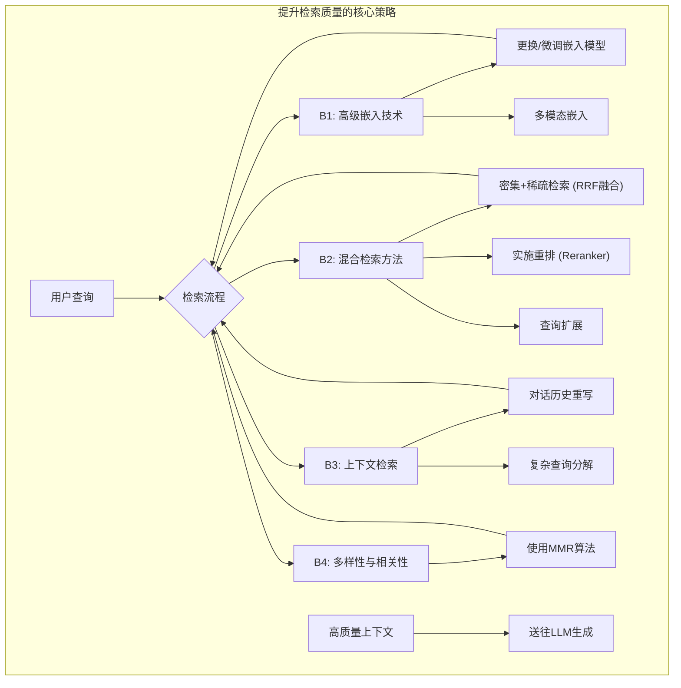

# 开篇：提高检索质量

如果说A篇的数据准备是为RAG系统提供了“纯净的弹药库”，那么本篇将要探讨的检索质量，则是为系统装上了一双锐利的“鹰眼”。这双眼睛必须能够在浩瀚如海的知识库中，于万千信息里，精准地锁定与用户意图最为契合的“猎物”，并以迅雷不及掩耳之势将其捕获。

一个拥有“鹰眼”的检索器，能为后续的语言模型提供高信噪比、高相关度的上下文，使其能够从容地组织和生成答案。相反，一个“近视”的检索器，只会抓来一堆杂草（不相关信息），迫使语言模型在垃圾堆里找线索，最终的结果要么是胡言乱语（幻觉），要么是答非所问。

本章将作为您的“鹰眼训练手册”，我们将从“引擎”本身出发，学习一系列高级的“炼金术”，旨在从沙中淘出真金，显著提升检索的精准度（Precision）和召回率（Recall）。本章将聚焦于四大核心策略：**高级嵌入技术**、**混合检索方法**、**上下文检索**以及**多样性与相关性的平衡**。

## 目录：

[**B1：高级嵌入技术——把握语义的核心**](https://www.notion.so/B1-26055a58d45c801ba749fb9c539dcae0?pvs=21)

[**B2：混合检索方法——集各家之所长**](https://www.notion.so/B2-26055a58d45c80919fe0ca89b3bab9bc?pvs=21)

[**B3：上下文检索——理解对话的流动**](https://www.notion.so/B3-26055a58d45c80aebeb8fb921fa827df?pvs=21)

[**B4：多样性与相关性的平衡——避免信息茧房**](https://www.notion.so/B4-26055a58d45c8053a0ebd66bf67c96c0?pvs=21)

### **引用文献 (References)**

- Humeau, S., Shuster, K., Lachaux, M. A., & Weston, J. (2019). Poly-encoders: Transformer Architectures and Pre-training Strategies for Fast and Accurate Multi-sentence Scoring. *arXiv preprint arXiv:1905.01969*.
- Lewis, P., Perez, E., Piktus, A., Petroni, F., Karpukhin, V., Goyal, N., ... & Kiela, D. (2020). Retrieval-Augmented Generation for Knowledge-Intensive NLP Tasks. *Advances in Neural Information Processing Systems, 33*, 9459-9474.
- Nogueira, R., & Cho, K. (2019). Passage Re-ranking with BERT. *arXiv preprint arXiv:1901.04085*.
- Radford, A., Kim, J. W., Hallacy, C., Ramesh, A., Goh, G., Agarwal, S., ... & Sutskever, I. (2021). Learning Transferable Visual Models From Natural Language Supervision. *International Conference on Machine Learning (ICML)*.
- Santhanam, K., Khattab, O., Saad-Falcon, J., & Potts, C. (2021). ColBERTv2: Effective and Efficient Passage Search via Late Interaction. *arXiv preprint arXiv:2112.01488*.