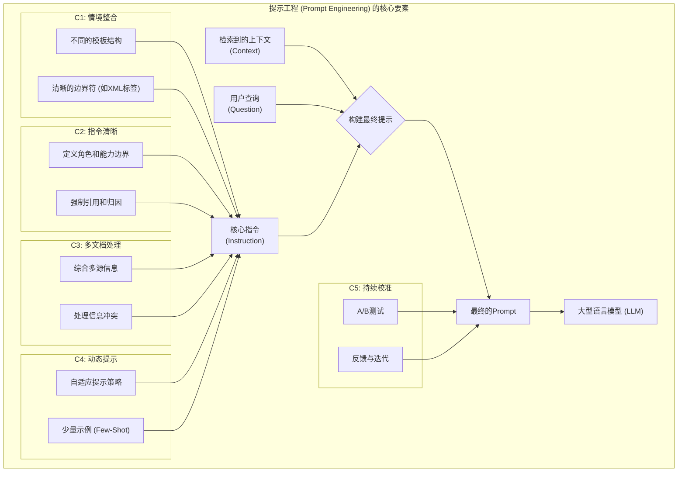

# 开篇：掌握RAG的提示工程

如果说检索器是RAG系统的“情报官”，负责搜集信息；那么提示（Prompt）就是系统的“总参谋长”，负责向“最高指挥官”（LLM）下达一份清晰、周密、无懈可击的作战计划。这份计划必须明确告知LLM：战场态势如何（检索到的上下文），作战目标是什么（用户的查询），以及必须遵守哪些交战规则（指令）。

一份精心设计的提示，能将一堆零散的情报（文本块），转化为一篇逻辑严谨、条理清晰、直击问题核心的行动报告。反之，一份模糊、有歧（yì）义的提示，则可能让最强大的LLM也感到困惑，导致它要么“将在外君令有所不受”（忽略上下文），要么“错误领会意图”（答非所问）。

提示工程（Prompt Engineering）是一门介于艺术与科学之间的学问。它既需要我们像科学家一样，通过实验和迭代来寻找最优的结构；也需要我们像艺术家一样，运用语言的精妙来激发模型的最大潜能。本章将作为您的“参谋长作战手册”，深入探讨RAG提示工程的五大核心环节：**情境整合**、**指令清晰**、**多文档处理**、**动态提示**和**持续校准**。

[**C1：情境整合——为模型搭建清晰的舞台**](https://www.notion.so/C1-26055a58d45c80c1b305d661c0160165?pvs=21)

[**C2：指令清晰——明确模型的任务与行为**](https://www.notion.so/C2-26055a58d45c802cb976c41dead8ab62?pvs=21)

[**C3：多文档综合策略 (Multi-Document Synthesis Strategies)**](https://www.notion.so/C3-Multi-Document-Synthesis-Strategies-26055a58d45c8044bf14e15af3604dd6?pvs=21)

[**C4：动态提示——灵活适应不同场景**](https://www.notion.so/C4-26055a58d45c80238fd7ffb58f94ea53?pvs=21)

[**C5：提示校准——持续迭代与优化**](https://www.notion.so/C5-26055a58d45c800eb2a1f1b6b033e00e?pvs=21)

- Anthropic. (2024). *Anthropic Cookbook: Using XML tags*. Retrieved from [**https://docs.anthropic.com/claude/docs/use-xml-tags**](https://www.google.com/url?sa=E&q=https%3A%2F%2Fdocs.anthropic.com%2Fclaude%2Fdocs%2Fuse-xml-tags)
- Brown, T. B., Mann, B., Ryder, N., Subbiah, M., Kaplan, J., Dhariwal, P., ... & Amodei, D. (2020). Language Models are Few-Shot Learners. *Advances in Neural Information Processing Systems, 33*, 1877-1901.
- Liu, N. F., Lin, K., Hewitt, J., Paranjape, A., Bevilacqua, M., Petroni, F., & Liang, P. (2023). Lost in the Middle: How Language Models Use Long Contexts. *arXiv preprint arXiv:2307.03172*.