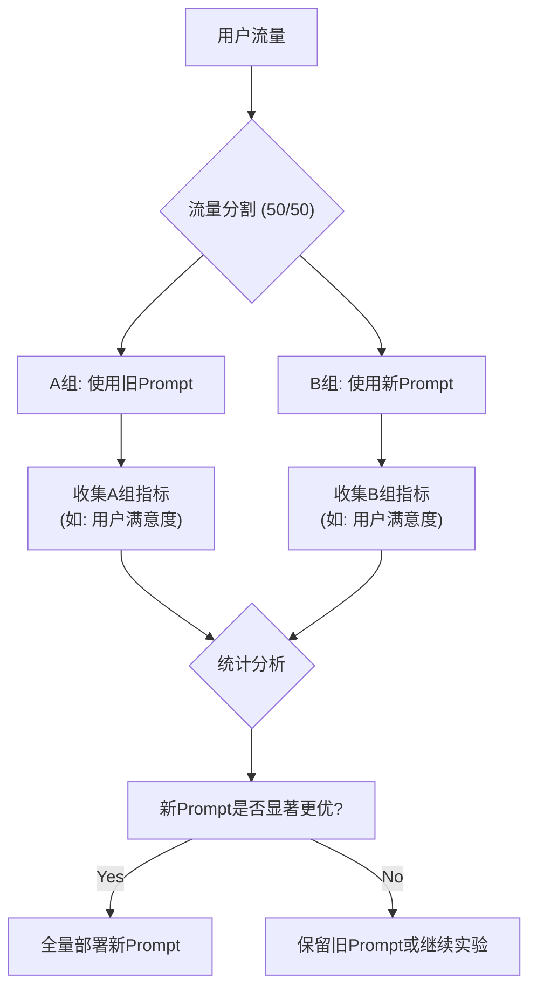

# C5：提示校准——持续迭代与优化

提示工程是一个动态的、永不停止的优化过程。最好的提示，是通过不断的评估、反馈和实验打磨出来的。这就像**调校一辆赛车**。你不能在车库里凭空想象最佳的悬挂设置。你必须把车开到赛道上（**A/B测试**），记录每一圈的性能数据（**评估指标**），听取车手的反馈（**用户反馈**），然后回到车库进行微调，再回到赛道上测试。这是一个持续的“测试-分析-调整”的循环。

## **构建系统化的评估流程**

- **创建“黄金标准”评估集 (Golden Set):**
    - **说明：** 这是进行所有离线评估的基础。你需要人工整理一个覆盖各种查询类型和边缘案例的测试集。每个样本应包含：question, ideal_context (理想中应该被检索到的文档), ideal_answer (人工编写的完美答案), bad_answer_example (一个典型的不良回答范例)。
- **实施自动化离线评估:**
    - **流程:** 每当一个新版本的Prompt被提出时，都应该自动运行一个评估流水线：
        1. 使用评估集中的question和ideal_context，通过新Prompt生成一个generated_answer。
        2. 使用G篇中提到的RAGAS等框架，将generated_answer与ideal_answer和ideal_context进行比较，自动计算出Faithfulness, Answer Correctness等一系列量化指标。
        3. 将新Prompt的指标得分与当前生产环境中的Prompt（Baseline）进行对比。
    - **优点:** 这种自动化的“回归测试”可以在几分钟内告诉你新Prompt是否在关键指标上有所改进或退步，大大提高了迭代效率。

## **A/B测试与线上实验的深化**

- **详细阐述：** 这是在生产环境中科学地比较不同提示策略的“金标准”。
- **从A/B测试到“Prompt锦标赛” (Prompt Tournament):**
    - **说明：** A/B测试通常只比较两个版本。对于提示工程，你可能同时有好几个候选版本。可以采用“锦标赛”或“多臂老虎机”（Multi-armed Bandit）的思路。
    - **方法：** 同时在线上部署多个Prompt版本（例如，版本A, B, C, D），系统根据实时的用户反馈（如“点赞率”）动态地调整分配给每个版本的流量。表现好的版本会获得更多流量，表现差的则逐渐被淘汰。
- **b. 细粒度的指标追踪:**
    - **说明：** 不要只看总体的用户满意度。要将指标按**查询类型**进行细分。
    - **示例：** 你的新Prompt可能在处理“比较类”问题时表现优异，但在处理“事实问答类”问题时反而有所下降。通过细粒度分析，你可以发现这一点，并考虑为不同类型的查询使用不同的Prompt（即C4中提到的动态提示）。
- **流程图：**

## **建立Prompt版本控制与管理平台**

- **将Prompt视为配置 (Prompt-as-Config):**
    - **说明：** 不要将Prompt硬编码在你的应用程序代码中。应该将它们作为独立的配置文件（如YAML, JSON）进行管理，并纳入Git等版本控制系统中。
    - **优点：**
        - **版本追溯：** 可以轻松地查看历史版本的Prompt，并进行回滚。
        - **非技术人员可参与：** 产品经理、运营人员等也可以在无需修改代码的情况下，参与到Prompt的优化中。
- **b. 构建Prompt Hub:**
    - **说明：** 在大型团队或企业中，可以建立一个内部的“Prompt Hub”或“Prompt注册中心”。
    - **功能：**
        1. **版本控制与存储：** 集中管理所有业务线的Prompt模板。
        2. **在线测试与评估：** 提供一个UI界面，让用户可以输入变量，快速测试不同版本的Prompt，并查看其离线评估得分。
        3. **A/B测试集成：** 与A/B测试框架打通，可以一键将某个版本的Prompt推送到线上进行实验。
        4. **性能监控：** 展示每个线上Prompt版本的实时性能指标（如用户满意度、生成延迟等）。
    - **价值：** 将零散的、个人化的Prompt调优工作，转变为一个系统化的、可协作的、数据驱动的工程流程。