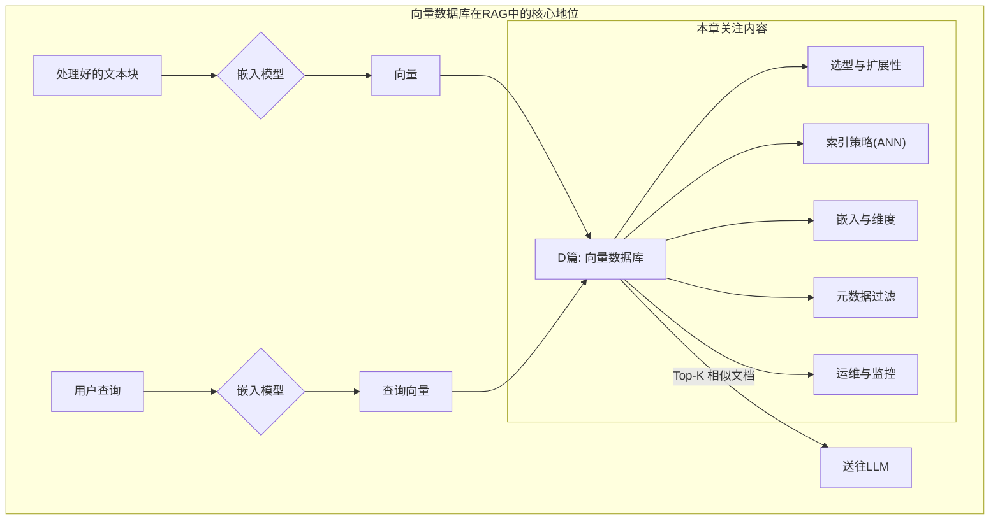

# 开篇：利用向量数据库实现高效RAG

如果说嵌入模型是赋予文本“灵魂”（即语义向量）的魔法师，那么向量数据库（Vector Database）就是承载这些灵魂、并能以光速响应召唤的“**中央记忆库**”。它不仅仅是一个存储向量的地方，更是一个经过极致优化的、专为高速相似性搜索而生的检索引擎。

想象一下《哈利·波特》中的**冥想盆**。邓布利多可以将自己的记忆（向量）抽出并存储在里面。当需要回忆某件事时（查询），他可以迅速潜入冥想盆，所有相关的记忆片段（文本块）都会自动浮现并聚集在一起。一个高效的向量数据库，就是这样一个能够存储海量“记忆”并能进行即时、精准“联想”的魔法工具。

在RAG系统中，向量数据库扮演着“中央神经系统”的角色，负责在毫秒之间处理来自“大脑”（查询）的信号，并从庞大的“记忆”（知识库）中精准地激活最相关的神经元（文本块）。选择、配置和优化这个核心基础设施，是决定RAG应用能否从一个有趣的实验原型，走向一个高性能、可扩展、稳定可靠的生产级服务的关键。本章将作为您的“架构师指南”，深入探索向量数据库的各个层面。

[**D1: 可扩展性与性能 (Scalability & Performance)**](https://www.notion.so/D1-Scalability-Performance-26055a58d45c80f5988afa5784603d72?pvs=21)

[**D2: 选择正确的向量数据库 (Choosing the Right Vector DB)**](https://www.notion.so/D2-Choosing-the-Right-Vector-DB-26055a58d45c80e0afb8c04989a7dc19?pvs=21)

[**D3: 索引策略 (Indexing Strategies)**](https://www.notion.so/D3-Indexing-Strategies-26055a58d45c806ca879c01048c5c845?pvs=21)

[**D4: 嵌入模型与维度 (Embedding Models & Dimensionality)**](https://www.notion.so/D4-Embedding-Models-Dimensionality-26055a58d45c807dab6edce912f0053c?pvs=21)

[**D5: 元数据与过滤 (Metadata & Filtering)**](https://www.notion.so/D5-Metadata-Filtering-26055a58d45c80ccb44ccc78ddc56999?pvs=21)

[**D6: 更新与维护 (Updating & Maintenance)**](https://www.notion.so/D6-Updating-Maintenance-26055a58d45c8028a02fca44ca97ecf2?pvs=21)

[**D7: 聚类与数据组织 (Clustering & Data Organization)**](https://www.notion.so/D7-Clustering-Data-Organization-26055a58d45c804f88aafd789b0b3137?pvs=21)

[**D8: 混合检索 (Hybrid Search)**](https://www.notion.so/D8-Hybrid-Search-26055a58d45c80f1a967e5097cf17203?pvs=21)

[**D9: 监控与优化 (Monitoring & Optimization)**](https://www.notion.so/D9-Monitoring-Optimization-26055a58d45c80a2aec7dd1a8c8db729?pvs=21)