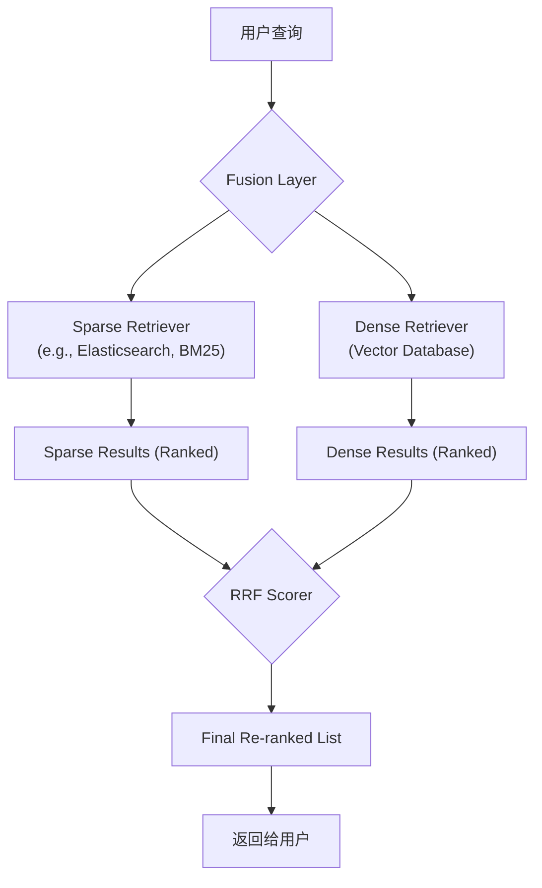

# D8：混合检索(Hybrid Search)

## **混合检索的必要性**

如A4篇所述，混合检索结合了**密集检索（语义）**和**稀疏检索（关键词）**的优点。

- **密集检索的盲点：** 可能无法精确匹配罕见的专有名词、ID号或特定的缩写。
- **稀疏检索的盲点：** 无法理解同义词或用户的深层意图。

## **融合策略详解：RRF**

倒数排序融合 (Reciprocal Rank Fusion - RRF) 是一种简单、高效且无需调参的融合方法。它完全忽略不同检索器的原始分数，只关心每个文档在各自结果列表中的**排名**，从而公平地结合了两种检索方式的优势。

## **架构考量**

实现混合检索，通常需要一个能够协同工作的系统架构。

