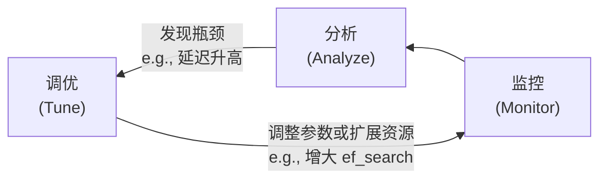

# D9：监控与优化 (Monitoring & Optimization)

## **监控的“黄金指标”**

- **查询性能指标:**
    - **p95/p99 Latency:** 绝大多数查询的响应时间。
    - **QPS:** 系统负载。
- **检索质量指标:**
    - **Recall@K:** 通过一个带标签的测试集，定期运行离线评估，检查返回的Top-K结果中包含了多少正确答案。这是衡量ANN索引准确性的核心指标。
- **系统资源指标:**
    - **CPU / GPU Utilization:**
    - **Memory Usage:**
    - **Disk I/O & Storage:**

## **优化是一个持续循环**

## **常见优化场景举例**

- **场景1：** 监控发现Recall@10下降。**分析：** 可能是ANN索引构建的质量不高。**调优：** 尝试在重建索引时，增大HNSW的ef_construction和M参数。
- **场景2：** 监控发现p99延迟在高并发时飙升。**分析：** ef_search参数可能设置得过高，导致CPU成为瓶颈。**调优：** 适当降低ef_search的值，或者进行水平扩展，增加更多的查询节点。