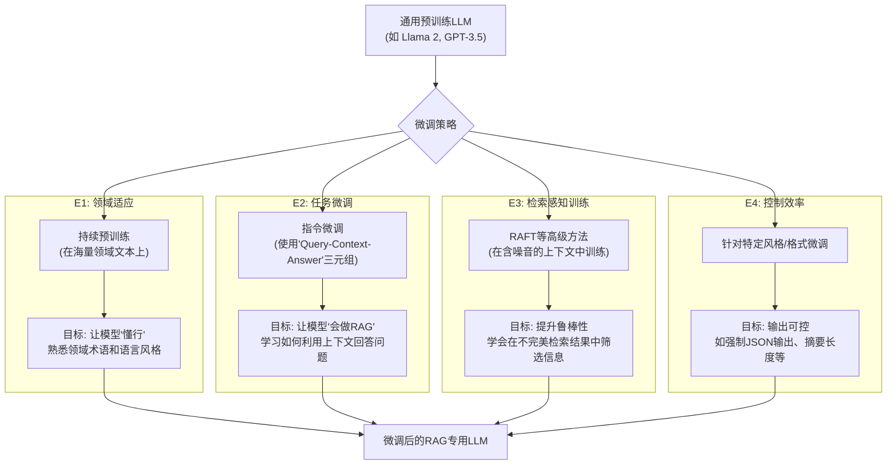

# 开篇：针对RAG微调语言模型

> **当RAG遇上微调——从“通用向导”到“领域大师”**
> 

在RAG的核心哲学中，LLM通常被视为一个“开箱即用”的、知识渊博的“通用向导”。它的能力主要依赖于我们（通过检索器）为它提供的“旅行手册”（外部知识）。然而，这并非故事的全部。在追求极致性能、解决特定领域挑战，或实现高度可控的生成行为时，我们可能需要对这位向导进行“岗前特别培训”。这就是**微调（Fine-tuning）**。

微调，不是给向导灌输新的地图知识（那是RAG检索器的任务），而是教会他如何**更好地阅读地图、如何使用特定领域的行话与客户沟通、如何根据客户的要求定制旅行路线**。它让模型从“有礼貌的通用回答”，转变为“深度契合领域特点的权威回答”。

本章将作为您的“高级培训师指南”，探讨将微调融入RAG体系的四大核心策略，帮助您将您的LLM从一个“通用向导”，打造成一位真正的“领域大师”。

[**E1：领域适应 (Domain Adaptation)——让模型成为领域专家**](https://www.notion.so/E1-Domain-Adaptation-26055a58d45c80b79c0cef14b35c3c42?pvs=21)

[**E2：针对特定任务微调 (Task-Specific Fine-tuning)——教会模型“RAG式思考”**](https://www.notion.so/E2-Task-Specific-Fine-tuning-RAG-26055a58d45c809ab6eaced31503772e?pvs=21)

[**E3：检索感知训练 (Retrieval-Aware Training)——让生成器更懂检索器**](https://www.notion.so/E3-Retrieval-Aware-Training-26055a58d45c8002a357d448b8de1e9a?pvs=21)

[**E4：控制效率 (Control Efficiency)——微调生成风格与内容**](https://www.notion.so/E4-Control-Efficiency-26055a58d45c80a997bce18229af8659?pvs=21)