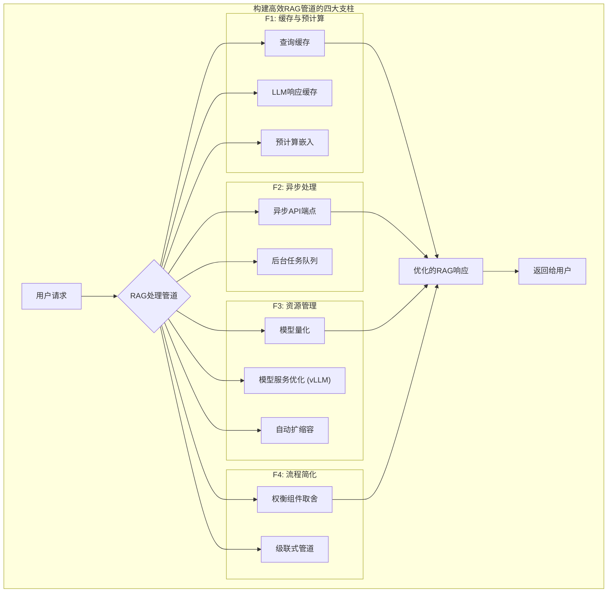

# 开篇：实施高效的RAG管道

> **从“能用”到“好用”，性能是生产的生命线**
> 

一个在Jupyter Notebook中表现完美的RAG原型，与一个能够承受数千用户并发请求、并在毫秒级内稳定响应的生产级系统之间，隔着一条名为“**性能与效率**”的鸿沟。在生产环境中，用户体验至上，而延迟（Latency）和吞吐量（Throughput）是用户体验最直接的体现。

这就像是从**手工打造一辆概念跑车**，到**建立一条能够大规模量产的汽车生产线**。

- **概念跑车（原型）：** 追求的是极致的功能和炫酷的设计，可以不计成本和时间。
- **生产线（生产系统）：** 追求的是**效率、稳定性和成本控制**。每一个环节都需要被优化，以确保每辆车都能被快速、高质量、低成本地制造出来。

本章将作为您的“**生产线优化指南**”，聚焦于RAG管道的工程实践，探讨如何通过一系列技术手段，将一个功能性的RAG流程，转变为一个高效、健壮且成本可控的生产服务。我们将深入研究四大核心策略：**缓存与预计算**、**异步处理**、**资源管理**和**流程简化**。

[**F1：缓存与预计算 (Caching & Pre-computation)——避免重复的昂贵劳动**](https://www.notion.so/F1-Caching-Pre-computation-26055a58d45c8015a409da601bfca131?pvs=21)

[**F2：异步处理 (Asynchronous Processing)——让等待变得“无感”**](https://www.notion.so/F2-Asynchronous-Processing-26055a58d45c80c1afd3c0ce29238903?pvs=21)

[**F3：资源管理 (Resource Management)——花好每一分钱**](https://www.notion.so/F3-Resource-Management-26055a58d45c80a5967af2802bb9b5e7?pvs=21)

[**F4：流程简化 (Process Simplification)——奥卡姆剃刀原则**](https://www.notion.so/F4-Process-Simplification-26055a58d45c8031b4e2f6a382a64e05?pvs=21)