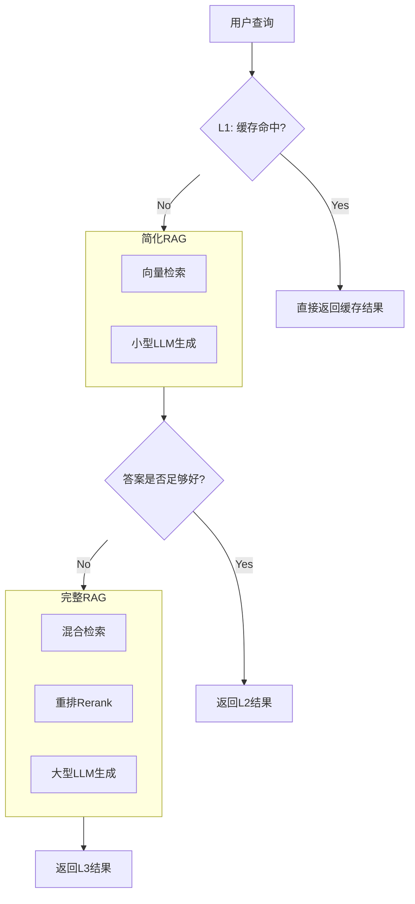

# F4：流程简化 (Process Simplification)——奥卡姆剃刀原则

“如无必要，勿增实体”。在追求性能的道路上，有时最有效的方法是“做减法”。

- **巧妙设计——“级联式管道” (Cascading Pipeline):**
    - **方法：** 设计一个多层次、从简到繁的RAG流程，优先用最快、最省钱的方式解决问题。
    - **流程图：**

• **优点：** 这种方法可以用最低的平均成本，处理绝大多数简单查询，同时保留了处理复杂查询的能力。

## **核心哲学：奥卡姆剃刀原则**

“如无必要，勿增实体”。有时最有效的优化是“做减法”。

## **权衡组件的取舍**

- **Reranker的必要性:** 重排器能提升精度，但也增加延迟。对于某些对延迟极度敏感的应用，是否可以去掉重排步骤？
- **查询扩展的性价比:** 查询扩展能提高召回率，但也增加了LLM调用。是否可以通过微调嵌入模型来达到类似的效果？

## **高级设计模式：级联式管道**

- **概念说明:** 设计一个多层次、从简到繁的RAG流程，优先用最快、最省钱的方式解决问题。
- **流程:**
    1. **L1 (缓存):** 检查缓存，命中则直接返回。
    2. **L2 (简化RAG):** 使用快速检索和小型LLM。
    3. **L3 (完整RAG):** 在L2无法满足需求时，才触发包含重排和大型LLM的完整流程。
- **优点：** 用最低的平均成本，处理绝大多数简单查询，同时保留了处理复杂查询的能力。