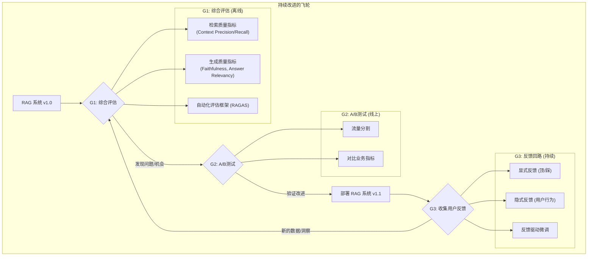

# 开篇：评估与持续改善

一个RAG系统上线运行，仅仅是其生命周期的开始。如何知道它在真实世界中的表现如何？我们的某项优化（例如，更换嵌入模型、调整Prompt）是带来了积极的改进，还是无意中引入了新的问题？

这就像**驾驶一艘现代帆船**。你不能只凭感觉来调整帆的角度。你需要依赖各种**仪表**：风速计告诉你风力变化，GPS告诉你航向是否偏离，速度计告诉你当前的航速。没有这些**度量**，你所有的调整都是盲目的。一个无法被度量的系统，也无法被有效地改进。

评估是连接“开发”与“运营”、“理论”与“实践”的桥梁。它为我们提供了一面“仪表盘”，客观地反映出系统的优点和短板，并指导我们进行数据驱动的决策。本章将作为您的“**仪表盘使用与导航手册**”，深入探讨RAG评估的三大支柱：**综合评估指标**、**A/B测试与实验**以及**反馈回路**。

[**G1：综合评估指标 (Comprehensive Evaluation Metrics)——RAG系统的“体检报告”**](https://www.notion.so/G1-Comprehensive-Evaluation-Metrics-RAG-26055a58d45c8076b1e4cca13d67685c?pvs=21)

[**G2：A/B测试和实验 (A/B Testing & Experimentation)**](https://www.notion.so/G2-A-B-A-B-Testing-Experimentation-26055a58d45c807c8554d34d5c8021a4?pvs=21)

[**G3：反馈回路 (Feedback Loop)——让用户成为你的“老师”**](https://www.notion.so/G3-Feedback-Loop-26055a58d45c800b96c8fae893c5fc1b?pvs=21)

- Es, S., E. J. van, L. de Vreese, & M. de Rijke. (2023). RAGAS: Automated Evaluation of Retrieval Augmented Generation. *arXiv preprint arXiv:2309.15217*.
- Lin, C. Y. (2004). ROUGE: A Package for Automatic Evaluation of Summaries. *Proceedings of the ACL-04 Workshop*.
- Papineni, K., Roukos, S., Ward, T., & Zhu, W. J. (2002). BLEU: a Method for Automatic Evaluation of Machine Translation. *Proceedings of the 40th Annual Meeting of the Association for Computational Linguistics (ACL)*.
- Zhang, T., Kishore, V., Wu, F., Weinberger, K. Q., & Artzi, Y. (2019). BERTScore: Evaluating Text Generation with BERT. *arXiv preprint arXiv:1904.09675*.