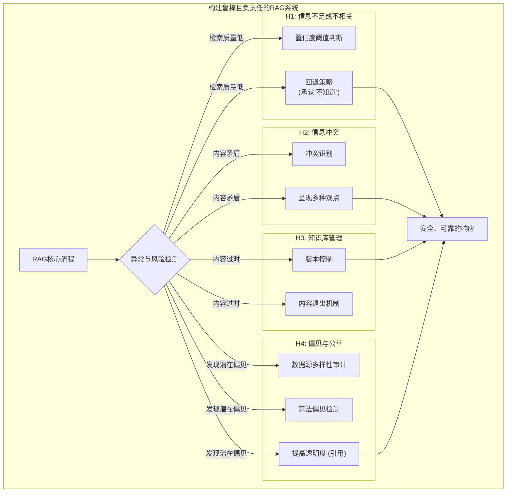

# 开篇：极端情况处理与伦理考量

> **卓越的系统不仅在于晴天表现，更在于风雨中的坚韧**
> 

一个RAG系统在理想条件下（查询清晰、知识库完备、信息一致）能给出精彩的回答，这固然重要。但一个真正成熟、可信赖的系统，其卓越之处更体现在它如何处理不完美的“现实世界”。这就像**设计一艘远洋巨轮**。它不仅要在风平浪静时航行平稳，更要在遭遇**狂风（信息不足）**、**浓雾（信息矛盾）**、甚至**暗礁（偏见与有害内容）**时，依然能够保持航向、保障乘客安全、并明确地向船长报告异常情况。一个只为“晴天”设计的系统，是无法在真实的海洋中生存的。

本章将作为您的“**安全与应急预案手册**”，聚焦于R-A-G系统的“韧性”与“责任感”。我们将探讨一系列防御性设计和策略，用于处理各种极端情况，确保系统在面对未知和挑战时，依然能够表现得安全、可靠且负责任。

[**H1：处理不充分或不相关的检索信息——学会“优雅地认输”**](https://www.notion.so/H1-26055a58d45c80dbb78ef88eb51cc0a1?pvs=21)

[**H2：处理矛盾的信息——成为“公正的仲裁者”**](https://www.notion.so/H2-26055a58d45c808da0a3c52829a97320?pvs=21)

[**H3：管理大型知识库——建立“生命周期”**](https://www.notion.so/H3-26055a58d45c8029ba70dfee988aa79f?pvs=21)

[**H4：解决偏见和公平问题——RAG的“道德罗盘”**](https://www.notion.so/H4-RAG-26055a58d45c80a4908fced1280e86bf?pvs=21)

Caliskan, A., Bryson, J. J., & Narayanan, A. (2017). Semantics derived automatically from language corpora contain human-like biases. *Science, 356*(6334), 183-186.