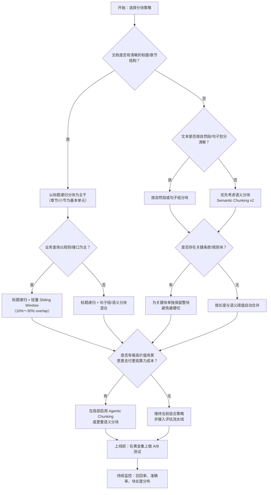

# 代码

1. `[[CODE_BLOCK_2_4_CHUNKING_DECISION_TREE_MERMAID]]` —— 分块策略决策树
2. `[[CODE_BLOCK_2_5_TITLE_RECURSIVE_CHUNKER_PY]]` —— 标题递归分块器
3. `[[CODE_BLOCK_2_7_SEMANTIC_CHUNK_V2_PY]]` —— Semantic Chunking v2 示例
4. `[[CODE_BLOCK_2_8_MULTIMODAL_CHUNKING_FLOW_MERMAID]]` —— 多模态分块流程图
5. `[[CODE_BLOCK_2_9_CHUNKING_EVAL_PIPELINE_PY]]` —— 分块质量评估流水线示例

---

## 1. 决策树：`[[CODE_BLOCK_2_4_CHUNKING_DECISION_TREE_MERMAID]]`

在正文里，把占位符替换成下面这段：



---

## 2. 标题递归分块器：`[[CODE_BLOCK_2_5_TITLE_RECURSIVE_CHUNKER_PY]]`

这个版本是**可运行的简化实现**，和你第 1 章的 `DocumentElement` 思路保持一致，可以直接放进书里。
在正文里用这一段替换占位符，并在注释中提一下“实际工程中可复用第 1 章的 DocumentElement”。

```python
from __future__ import annotations

import re
from dataclasses import dataclass, field
from typing import Any, Dict, List, Optional


@dataclass
class DocumentElement:
    """简化版的文档元素，和第 1 章中的定义保持一致。

    在真实项目中建议直接复用第 1 章的 DocumentElement 实现。
    """

    text: str
    metadata: Dict[str, Any]
    element_type: str = "text"  # 例如: "title" / "narrative_text" / "table" / ...


@dataclass
class Chunk:
    """标题递归分块后的结果块。"""

    text: str
    metadata: Dict[str, Any] = field(default_factory=dict)


class TitleRecursiveChunker:
    """基于标题层级的递归分块器（简化示例版）。

    设计要点:
    - 以标题元素为“骨架”，维护一个 heading_stack 存储层级路径
    - 普通文本在当前标题路径下不断累积，超过 max_chars 时适度切分
    - 为每个 chunk 写入 heading_path 等关键信息，方便后续检索与展示
    """

    def __init__(
        self,
        max_chars: int = 1200,
        min_chars: int = 200,
    ) -> None:
        self.max_chars = max_chars
        self.min_chars = min_chars

    def _detect_heading_level(self, el: DocumentElement) -> Optional[int]:
        """检测标题层级。

        优先使用 metadata["heading_level"]，没有则回退到 Markdown 风格的 #/##/### 解析。
        """
        level = el.metadata.get("heading_level")
        if isinstance(level, int) and level > 0:
            return level

        if el.element_type != "title":
            return None

        # 简单解析形如 "# 一级标题" / "## 二级标题" 的 Markdown 标题
        m = re.match(r"^(#+)\s+", el.text.strip())
        if m:
            return len(m.group(1))

        # 如果确定是标题但没有显式层级，就当成一级标题
        return 1

    def _flush_chunk(
        self,
        chunks: List[Chunk],
        heading_stack: List[str],
        current_parts: List[str],
        current_metadata: Dict[str, Any],
    ) -> None:
        """将当前累积的文本刷新为一个 Chunk。"""
        if not current_parts:
            return

        text = "\n".join(current_parts).strip()
        if not text:
            current_parts.clear()
            current_metadata.clear()
            return

        # 构造 chunk 元数据
        meta = dict(current_metadata)
        heading_path = " / ".join(h for h in heading_stack if h)
        if heading_path:
            meta["heading_path"] = heading_path

        chunks.append(Chunk(text=text, metadata=meta))

        current_parts.clear()
        current_metadata.clear()

    def chunk(self, elements: List[DocumentElement]) -> List[Chunk]:
        """对一串 DocumentElement 进行标题递归分块。

        参数:
            elements: 按文档顺序排好的一维元素流。

        返回:
            若干 Chunk，保证:
            - 每个 Chunk 都挂在一个清晰的 heading_path 下
            - Chunk 长度大致控制在 max_chars 左右（但不会强行切断标题）
        """
        chunks: List[Chunk] = []
        heading_stack: List[str] = []

        current_parts: List[str] = []
        current_metadata: Dict[str, Any] = {}

        current_len = 0

        for el in elements:
            level = self._detect_heading_level(el)

            # 命中标题: 先刷新前一个 chunk，再更新 heading_stack
            if level is not None:
                self._flush_chunk(chunks, heading_stack, current_parts, current_metadata)

                # 调整标题层级栈
                if len(heading_stack) < level:
                    heading_stack.extend([""] * (level - len(heading_stack)))
                heading_stack[level - 1] = el.text.strip()
                # 丢弃更深层级的旧标题
                del heading_stack[level:]

                # 把标题自身信息写入“当前上下文”的基础元数据中
                current_metadata.update(el.metadata)
                continue

            # 普通文本元素
            text = (el.text or "").strip()
            if not text:
                continue

            # 简单按字符数控制 chunk 长度（工程实践中可以替换为 token 级别计算）
            if current_len and current_len + len(text) + 1 > self.max_chars:
                # 当前块太长了，先刷新掉
                self._flush_chunk(chunks, heading_stack, current_parts, current_metadata)
                current_len = 0

            if not current_parts:
                # 初始化当前块的基础元数据（例如页码、文件名等）
                current_metadata.update(el.metadata)

            current_parts.append(text)
            current_len += len(text) + 1  # 粗略计入换行/空格

        # 处理尾部残留
        self._flush_chunk(chunks, heading_stack, current_parts, current_metadata)

        return chunks
```

> PS：这里用的是 **字符数** 来控制长度，书里可以顺带写一句「工程上建议换成 token 计数或可插拔计数器」。

---

## 3. Semantic Chunking v2 示例：`[[CODE_BLOCK_2_7_SEMANTIC_CHUNK_V2_PY]]`

这个示例使用 LlamaIndex 的 `SemanticSplitterNodeParser`，选了最简闭环：
给一个文件 → 读成 `Document` → 语义分块 → 返回 chunk 文本。

在正文里替换为：

```python
from __future__ import annotations

from pathlib import Path
from typing import List

from llama_index.core import Document
from llama_index.core.node_parser import SemanticSplitterNodeParser
from llama_index.embeddings.openai import OpenAIEmbedding


def build_semantic_chunks_from_file(path: str | Path) -> List[str]:
    """使用 LlamaIndex 的 SemanticSplitterNodeParser 进行语义分块示例。

    注意:
    - 需要提前在环境变量中配置 OPENAI_API_KEY，或自行替换为其他 embedding 实现
    - 不同版本的 LlamaIndex API 可能略有差异，使用前请参考官方文档
    """
    path = Path(path)
    text = path.read_text(encoding="utf-8")

    # 构造 Document，附带最基本的元数据
    documents = [
        Document(
            text=text,
            metadata={"source": str(path)},
        )
    ]

    # 这里以 OpenAIEmbedding 为例，实际项目中可以替换为任意兼容的 embedding 模型
    embed_model = OpenAIEmbedding()

    splitter = SemanticSplitterNodeParser(
        embed_model=embed_model,
        buffer_size=1,
        breakpoint_percentile_threshold=95,
    )

    nodes = splitter.get_nodes_from_documents(documents)

    # 为简单起见，这里只返回各个 chunk 的文本；在真实项目中建议保留 nodes 对象及其 metadata
    chunks: List[str] = [node.text for node in nodes]
    return chunks


if __name__ == "__main__":
    example_file = Path("data/policy_example.md")
    chunks = build_semantic_chunks_from_file(example_file)
    print(f"共得到 {len(chunks)} 个语义 chunk")
    for i, ck in enumerate(chunks[:3], start=1):
        print(f"\n=== Chunk #{i} ===\n{ck[:200]}...")
```

> 你可以在书里脚注一句：
> “本示例采用 LlamaIndex 官方 `SemanticSplitterNodeParser`，具体参数和 API 以读者当前版本文档为准。”

---

## 4. 多模态分块流程图：`[[CODE_BLOCK_2_8_MULTIMODAL_CHUNKING_FLOW_MERMAID]]`

替换占位符为下面这段 mermaid 图：

```mermaid
flowchart LR
    A[原始元素流<br/>DocumentElement 列表] --> B{元素类型？}

    B -->|表格 table| C[整表作为一个 chunk<br/>保留原始结构/坐标<br/>并生成 Markdown 文本表示]
    B -->|图片/图表 figure| D[整图作为一个 chunk<br/>保存 image_id + 元数据<br/>调用多模态模型生成描述文本]
    B -->|公式 formula| E[整 LaTeX/MathML 块<br/>禁止在中间切分<br/>为每个公式生成可读描述]
    B -->|代码块 code| F[整段代码块<br/>保留语言、文件名、行号<br/>仅做最小必要清洗]
    B -->|纯文本 text| G[发送到常规文本分块流水线<br/>(标题递归 / 语义分块等)]

    C --> H[写入: 表格文本 + 结构化元数据<br/>进入向量索引]
    D --> H
    E --> H
    F --> H
    G --> H

    H --> I[检索阶段: 根据查询召回<br/>文本块 + 相关图表/公式/代码块]
```

这个图和你第 4 章“多模态清洗”是连起来的：

* 上游 CleanseMaster / 多模态解析生成 `DocumentElement`；
* 这一节负责决定**怎么分块 + 怎么挂多模态上下文**。

---

## 5. 分块质量评估流水线：`[[CODE_BLOCK_2_9_CHUNKING_EVAL_PIPELINE_PY]]`

这是一个**最小可用的评估脚本**，假设你有一份 `golden_samples.jsonl`：
每行一个样本，包含 `id / query / relevant_chunk_ids`。
评估逻辑是：给定 `retrieve_fn`，算每条样本的 chunk hit rate，再算 macro recall。

在正文里替换为：

```python
from __future__ import annotations

import json
import logging
from dataclasses import dataclass
from pathlib import Path
from statistics import mean
from typing import Any, Callable, Dict, Iterable, List

logging.basicConfig(level=logging.INFO)
logger = logging.getLogger(__name__)


@dataclass
class GoldenSample:
    """用于评估分块质量的黄金样本。

    假定标注数据格式为 JSON Lines，每行类似:
    {
        "id": "case-001",
        "query": "示例问题",
        "relevant_chunk_ids": ["doc1:12", "doc1:13"]
    }
    """

    id: str
    query: str
    relevant_chunk_ids: List[str]


@dataclass
class EvalResult:
    sample_id: str
    hit_rate: float
    retrieved_ids: List[str]


def load_golden(path: Path) -> List[GoldenSample]:
    samples: List[GoldenSample] = []
    with path.open("r", encoding="utf-8") as f:
        for line in f:
            if not line.strip():
                continue
            obj = json.loads(line)
            samples.append(
                GoldenSample(
                    id=obj["id"],
                    query=obj["query"],
                    relevant_chunk_ids=list(obj.get("relevant_chunk_ids", [])),
                )
            )
    logger.info("加载黄金样本 %d 条", len(samples))
    return samples


def evaluate_chunking(
    golden_samples: Iterable[GoldenSample],
    retrieve_fn: Callable[[str, int], List[Dict[str, Any]]],
    top_k: int = 10,
) -> Dict[str, Any]:
    """基于黄金样本评估当前“分块 + 检索”策略的效果。

    参数:
        golden_samples: 标注好的测试集
        retrieve_fn:    检索函数，签名为 (query, top_k) -> List[{"chunk_id": str, ...}]
        top_k:          每个 query 检索的上限数

    返回:
        一个包含整体指标和逐条样本结果的字典，可直接写入 JSON / 指标系统。
    """
    results: List[EvalResult] = []

    for sample in golden_samples:
        retrieved = retrieve_fn(sample.query, top_k=top_k)
        retrieved_ids = [str(item.get("chunk_id")) for item in retrieved if "chunk_id" in item]

        if not sample.relevant_chunk_ids:
            # 没有标注相关 chunk 的样本可以跳过或单独记录
            logger.warning("样本 %s 未提供 relevant_chunk_ids，跳过", sample.id)
            continue

        hits = len(
            {
                rid
                for rid in retrieved_ids
                if rid in set(sample.relevant_chunk_ids)
            }
        )
        hit_rate = hits / len(sample.relevant_chunk_ids)

        results.append(
            EvalResult(
                sample_id=sample.id,
                hit_rate=hit_rate,
                retrieved_ids=retrieved_ids,
            )
        )

    if not results:
        logger.warning("没有有效评估结果，请检查黄金集或标注字段。")
        return {}

    macro_recall = mean(r.hit_rate for r in results)

    # 也可以根据业务需要扩展更多指标，如 top-1 命中率、mAP 等
    summary = {
        "macro_recall": macro_recall,
        "num_samples": len(results),
        "details": [r.__dict__ for r in results],
    }

    logger.info("分块+检索评估完成: macro_recall=%.4f, 样本数=%d", macro_recall, len(results))
    return summary


if __name__ == "__main__":
    # 示例: 从本地 golden_samples.jsonl 加载样本，并用一个假想的 retrieve_fn 做评估

    def dummy_retrieve_fn(query: str, top_k: int = 10) -> List[Dict[str, Any]]:
        """占位示例: 实际项目中请替换为你们自己的检索函数。"""
        # 这里只是演示结构，真实实现中应调用向量库/检索器并返回带 chunk_id 的结果。
        return []

    golden_path = Path("data/golden_samples.jsonl")
    golden = load_golden(golden_path)

    summary = evaluate_chunking(golden, retrieve_fn=dummy_retrieve_fn, top_k=10)
    print(json.dumps(summary, ensure_ascii=False, indent=2))
```

